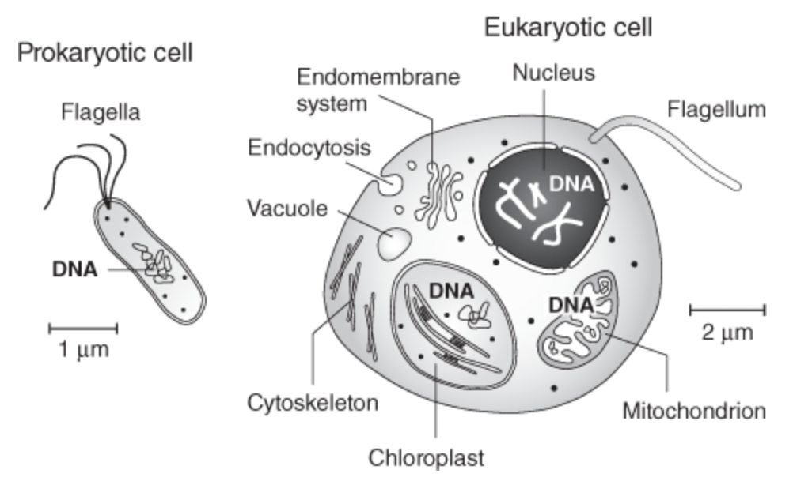

# Genomics: A Very Short Introduction - John Archibald (2018)
Will explore the science of genomics and its rapidly expanding toolbox.
* Broad overview
* The molecular biology upon which genomics is based
* Examples of the scientific questions it is used to address
* How it impacts our daily lives
* How it is likely to do so in the future

### 1. What is genomics? ###
* Genome - the sum total of DNA inside the single or multiple cells of an organism. This includes non-coding DNA.
* Humans have two genomes - one in the cell nucleus and the other in the mitochondrion.
* Cell is the fundamental unit of life. Two main types:
    1. Prokaryotes - microscopic, single-cell. Bacteria, E-Coli in gut. Archaea
    2. Eukaryotes - numerous membrane-bound compartments. Nucleus, mitochrondrian, chloroplasts. Cytoskeleton - protein based internal scaffolding system that allows eukaryotes to change shape and size.
    
* Viruses are neither prokaryotes or eukaryotes. (More in Chapter 6)
* DNA spiralling ladder - steps built from nucleotides which contain a negatively charged phosphate on the outside, a so-called base on the inside and a sugar linking the two.
  * Four bases in DNA: Adenine (A), Cytosine (C), Guanine (G), Thymine (T)
  * A-T and C-G. These are the 'base pairs' (bp)
* DNA replication - pull two strands of the double helix apart. Once apart, the cell uses each single strand as a template for the sequential addition of complementary nucleotides. End result is two DNA double helices.
  * Extremely accurate but not perfect
  * During this process most mutations in DNA arise.
  * The complimentary nature of the two strands of DNA means only one strand needs to be sequenced
* The mechanism by which genes mediate the synthesis of proteins also involves separation of the double helix.
### 2. How to read the book of life ### 
### 3. Making sense of genes and genomes ###
### 4. The human genome in biology and medicine ###
### 5. Evolutionary genomics ###
### 6. Genomics and the microbial world ###
### 7. The future of genomics ### 